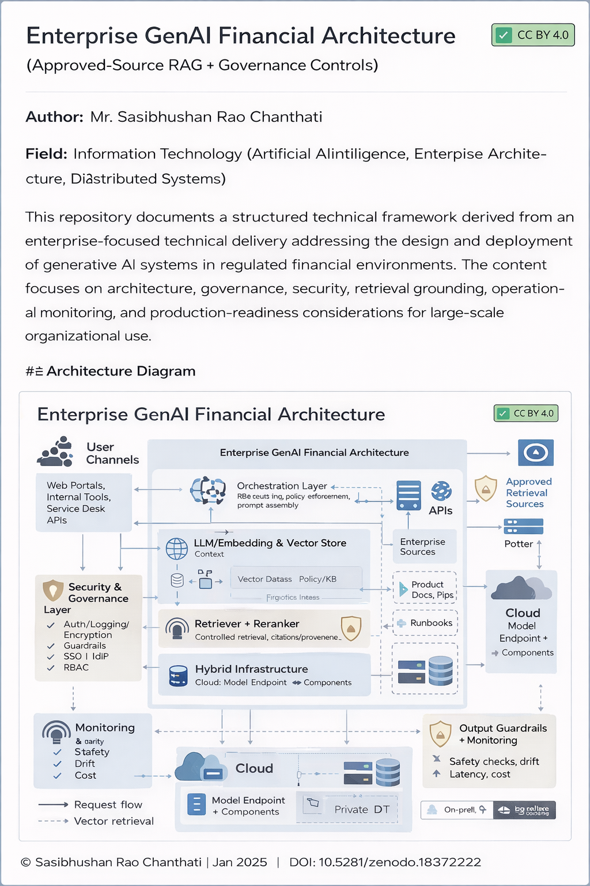

# Enterprise Generative AI Financial Architecture

**Author:** Mr. Sasibhushan Rao Chanthati  
**Field:** Information Technology (Artificial Intelligence, Enterprise Architecture, Distributed Systems)

## Context
This repository documents a structured technical framework derived from an enterprise-focused technical delivery addressing the design and deployment of generative AI systems in regulated financial environments. The content focuses on architecture, governance, security, retrieval grounding, operational monitoring, and production-readiness considerations for large-scale organizational use.

## Table of Contents
- [Abstract](#abstract)
- [Scope of the Framework](#scope-of-the-framework)
- [Technical Framework Overview](#technical-framework-overview)
- [Architecture Diagram](#architecture-diagram)
- [Repository Structure](#repository-structure)
- [Versioning](#versioning)
- [License](#license)

## Abstract
This project presents a reference architecture and implementation-oriented framework for deploying generative AI systems in financial and other regulated enterprise environments. It addresses key technical dimensions including governance constraints, privacy-preserving data handling, domain-specific model preparation, Retrieval-Augmented Generation (RAG) pipelines, approved-source retrieval, hybrid deployment patterns, system performance considerations, operational monitoring, and production-readiness tradeoffs. The framework is designed to support scalable, auditable, and reliable AI system behavior in real-world enterprise settings.

## Scope of the Framework
This repository covers the following technical areas:
- Governance and regulatory-aligned architecture patterns for enterprise AI  
- Secure handling of sensitive data, including PII masking approaches  
- Domain-aware model preparation using embeddings for financial semantics  
- Enterprise RAG pipelines grounded in organization-approved information sources  
- Hybrid deployment models combining on-premise and cloud infrastructure  
- System performance considerations for large-scale user environments  
- Operational monitoring, drift oversight, and lifecycle management  
- Practical production constraints including cost, scope, and feasibility  

## Technical Framework Overview

### 1. Governance and Compliance Architecture
Defines architectural controls to avoid training models on sensitive datasets, enforce auditability, and constrain model behavior in production environments.

### 2. Privacy and Data Protection Controls
Describes approaches for masking personally identifiable information (PII), access segmentation, and workflow controls when AI systems interact with identity-sensitive data.

### 3. Domain-Specific Model Preparation
Introduces techniques for adapting models to financial language using vector embeddings to represent domain-specific terminology and semantics.

### 4. Enterprise Retrieval-Augmented Generation (RAG)
Outlines a controlled retrieval architecture in which models access up-to-date content from curated, organization-approved knowledge sources rather than open or generic sources.

### 5. Hybrid Infrastructure Architecture
Presents deployment patterns combining on-premises environments with cloud-based components, with attention to reliability, scalability, and architectural tradeoffs.

### 6. Performance and Scalability Considerations
Discusses how workload characteristics, user concurrency, and architectural decisions influence responsiveness and system stability.

### 7. Monitoring and Operational Oversight
Defines mechanisms for observing model behavior post-deployment, tracking system health, and ensuring outputs remain aligned with intended operational constraints.

### 8. Production Readiness and Tradeoffs
Examines cost considerations, data relevance, fine-tuning scope, and practical constraints that influence design decisions in real-world implementations.

## Architecture Diagram

## Repository Structure

### Documentation (`/docs`)
### Documentation (`/docs`)
### Documentation (`/docs`)
- [Enterprise Architecture](docs/enterprise-architecture.md)
- [Governance Controls](docs/governance-controls.md)
- [RAG Pipeline](docs/docs/rag-pipeline.md)
- [Deployment Model](docs/docs/deployment-model.md)

### Diagram (`/diagram`)
- [Reference Architecture PNG](diagram/enterprise-genai-financial-architecture.png)

### Implementation Notes (`/src`)
- [Reference Implementation Notes](src/reference-implementation.md)

## Versioning
Initial public release: v1.0.0

## License
Creative Commons Attribution 4.0 International (CC BY 4.0)

## How to Cite
Chanthati, S. R. (2026). *Enterprise Generative AI Financial Architecture* (v1.0.0). Zenodo.  
https://doi.org/10.5281/zenodo.18372222

